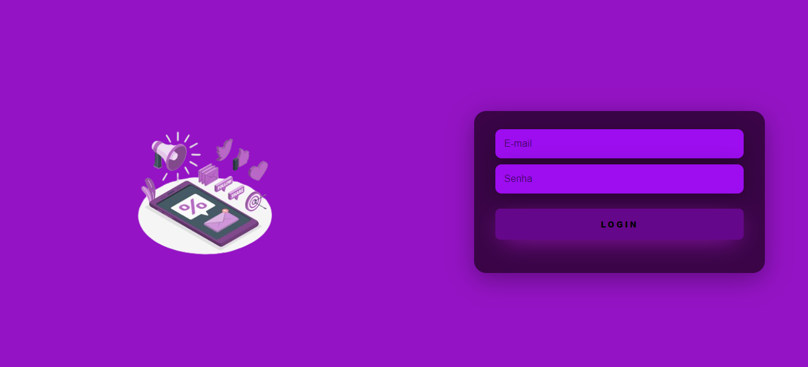

# Formulário de Login

## 🚀 Começando
Nesse projeto, criamos uma tela de login na matéria de:
* Fundamentos de Desenvolvimento Web.

## 📋 Sobre o projeto
Projeto criado para termos uma tela de login e utilizaremos no 2° Ano do EM em prol de construirmos um site, utilizando o form-CadEcommerce. 

## Descrição do projeto
Esse conjunto de atividades se baseia em fazermos uma pesquisa sobre sites de Ecommerce diferentes e criarmos o nosso próprio site. Na primeira parte, criamos uma tarefa para a tela de Formulário de Cadastro. Após isso, criamos essa atividade que consiste em ser a Tela de Login.

## 🔨Técnicas e Tecnologias utilizadas
* Visual Studio Code 
* Git Bash
* Git Hub
* HTML5
* CSS3
* Live Server (A extensão Live Server para VSCode permite criar um servidor local através do VSCode. Com ele cortamos a necessidade de sempre que fizermos uma alteração no código atualizar o navegador.)
* Bootstrap 5

## ✍🏻Autores
| [ Larissa Gabrielle Fagundes Andrade.](https://github.com/gabriellefagundes) |
| :---: 